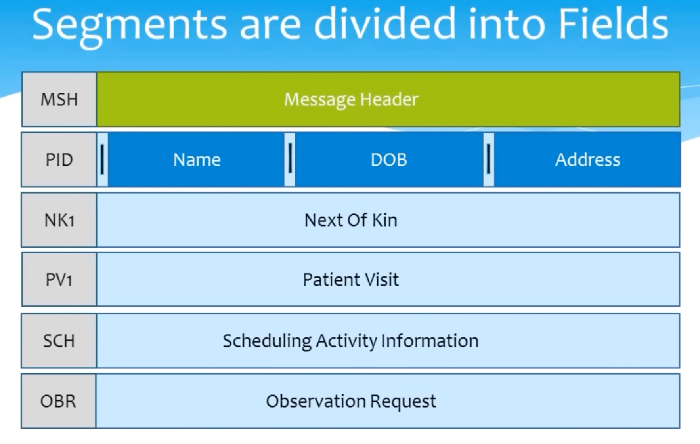

# Demystify HL7

## HL7 (Health Level 7) Overview

HL7, which stands for Health Level 7, is a set of international standards for the exchange, integration, sharing, and retrieval of electronic health information. These standards define how healthcare information should be formatted, transmitted, and processed for seamless interoperability between different healthcare systems and organizations.

## Key Features of HL7

1. **Interoperability**: HL7 standards promote interoperability by enabling different healthcare systems to communicate and exchange data efficiently. This ensures that healthcare providers can access and share patient information regardless of the software or systems they use.

2. **Structured Data**: HL7 standards facilitate the exchange of structured and standardized data, ensuring that healthcare information is organized and consistent across different systems. This structured data includes patient records, laboratory results, and more.

3. **Message Formats**: HL7 messages are used to transmit information between healthcare applications. These messages follow specific formats, including HL7 Version 2.x and HL7 Version 3. These formats define how data should be organized and communicated.

4. **Clinical and Administrative Data**: HL7 standards cover a wide range of healthcare data, including clinical data (e.g., patient demographics, diagnoses, and medications) and administrative data (e.g., scheduling, billing, and insurance information).

5. **Integration with EHRs**: HL7 standards play a crucial role in the integration of Electronic Health Records (EHRs) and other healthcare information systems. They allow for the exchange of patient data between these systems, improving patient care and reducing errors.

6. **Continual Development**: HL7 is an evolving set of standards, with ongoing development and updates to meet the changing needs of the healthcare industry. Users can stay current with the latest standards and specifications.

## HL7 Versions

HL7 has different versions, with HL7 Version 2.x and HL7 Version 3 being the most widely used. Each version has its own specifications and message formats. HL7 Version 2.x is more common and is known for its flexibility, while HL7 Version 3 is based on a more structured and standardized approach.

## Use Cases of HL7

HL7 standards are used in various healthcare scenarios, including:
- **Healthcare Information Exchange**: Facilitating the exchange of patient information among healthcare providers.
- **Clinical Research**: Supporting the exchange of clinical trial data and research findings.
- **Laboratory Information Systems**: Standardizing the exchange of laboratory test results.
- **Public Health Reporting**: Enabling the reporting of public health data to authorities.
- **Healthcare Administration**: Streamlining administrative processes such as billing and insurance claims.

In summary, HL7 plays a critical role in achieving healthcare interoperability and ensuring that patient data can be shared, accessed, and utilized effectively in the healthcare industry.

### Why Data Standarads Need?

## HL7 Format
All HL7 messages are divided up into Segments of related information, and these are always separated by a carriage return. Each of these segments are simply a separate line of the message.
The first Segment in every HL7 Message is always the Message Header, a Segment that conveys the metadata of the message like who sent it and when. The Message header is indicated in the first three letters of the segment as MSH.

In fact every Segment has its own three letter header that identifies what the segment is about.

### HL7 Message Segments Example

### HL7 Message Segment Fields Example

### HL7 Message Segment Field Compoenents Divided by ``^`` Example

### HL7 Message Segment Field Compoenents Divided into Sub  Components using ``&`` Example

### HL7 Message Segment Field Repeatable Compoenents using ``~`` Example

### HL7 Message Example

## HL7 Format Example

