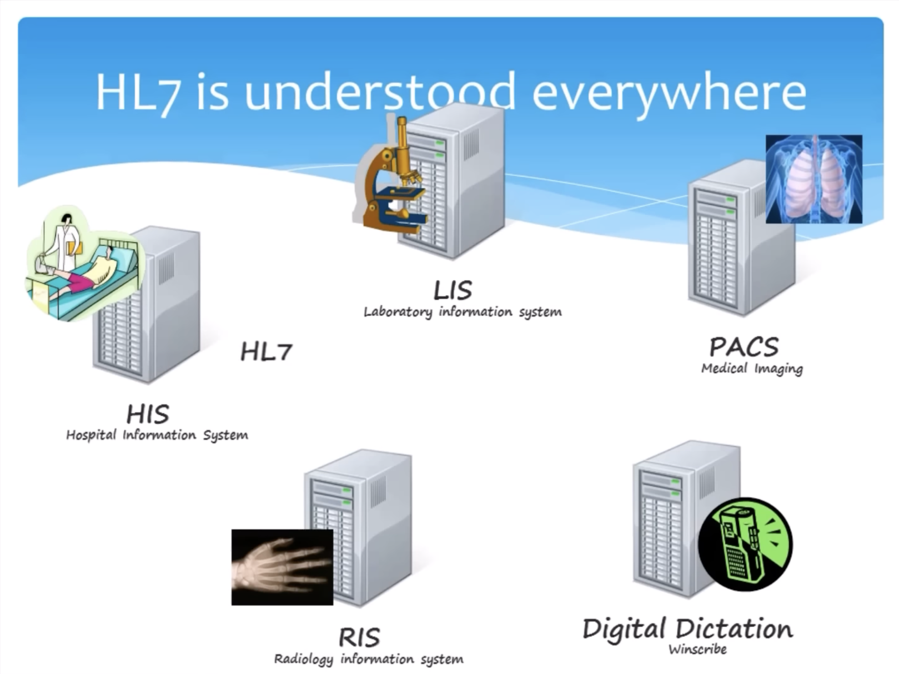
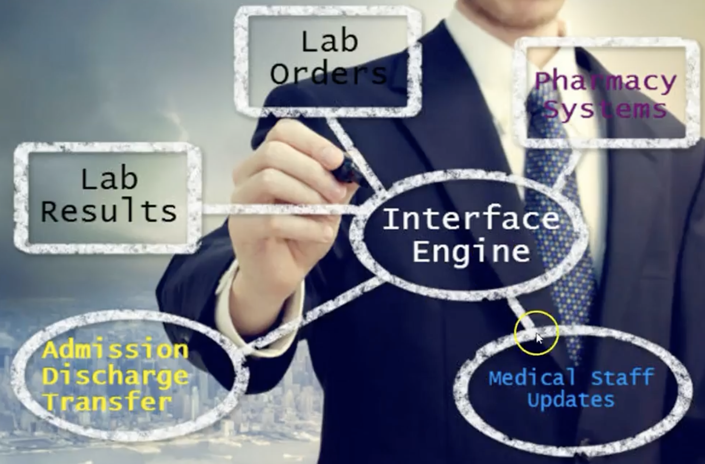

# Demystify Healthcare System

## Different Systems Involved

### HIS
It is a comprehensive, integrated information system designed to manage various aspects of hospital operations, including administrative, financial, and clinical functions. HIS plays a crucial role in improving the overall efficiency, quality of care, and patient safety in healthcare facilities, particularly in hospitals. Here are some key components and functionalities of a Hospital Information System:

1. ``Patient Management``: HIS manages patient registration, admission, discharge, and transfer processes. It tracks patient demographics, medical history, and other relevant information.

2. ``Appointment Scheduling``: HIS can schedule patient appointments for various medical services, helping to manage patient flow within the hospital.

3. ``Billing and Financial Management``: It handles billing, invoicing, and financial transactions, including insurance claims and payments. This ensures efficient revenue management.

4. ``Pharmacy Management``: HIS assists in managing hospital pharmacies by tracking medication orders, inventory, dispensing, and billing.

5. ``L``aboratory Information``: It integrates with Laboratory Information Systems (LIS) to manage test orders, results, and reports. It helps healthcare providers access lab data efficiently.

6. ``Radiology Information``: HIS can integrate with Radiology Information Systems (RIS) and Picture Archiving and Communication Systems (PACS) to manage radiology orders, images, and reports.

7. ``Electronic Health Records (EHR)``: HIS may include electronic health record functionality, allowing healthcare providers to access and update patient records digitally.

8. ``Inventory Management``: HIS helps manage hospital inventory, including medical supplies, equipment, and medications, to prevent shortages and optimize resource allocation.

9. ``Staff Management``: It can track employee schedules, attendance, and payroll, helping in staff management and workforce optimization.

10. ``Patient Care Coordination``: HIS facilitates better coordination of care among different healthcare professionals within the hospital, ensuring that the patient receives the necessary treatment and services.

11. ``Reporting and Analytics``: HIS generates reports and provides analytics to assist hospital administrators in decision-making and improving operational efficiency.

12. ``Compliance and Regulations``: It helps hospitals adhere to healthcare regulations and standards, ensuring that the hospital's practices are in compliance with legal and ethical guidelines.

### LIS (Laboratory Information System)
A Laboratory Information System is used in clinical laboratories to manage and streamline various laboratory processes. It assists in sample tracking, result reporting, quality control, and data management in clinical and research laboratories.

### PACS (Picture Archiving and Communication System)
PACS is a comprehensive medical imaging system that stores, retrieves, and distributes medical images such as X-rays, MRIs, and CT scans. It allows healthcare professionals to view and interpret images digitally, eliminating the need for film-based images. PACS improves image accessibility and facilitates collaboration among healthcare providers.

### RIS (Radiology Information System)
A Radiology Information System is a specialized software system used in radiology departments to manage patient information, scheduling, billing, and reporting related to radiology procedures. It helps radiologists and healthcare providers efficiently manage their radiology workflow.

### Digital Dictation
A digital dictation system is a technology that allows healthcare professionals, particularly doctors and radiologists, to dictate and transcribe medical reports and notes using digital audio recording devices. These systems enable efficient and accurate documentation of patient information.

### DICOM (Digital Imaging and Communications in Medicine):
DICOM is not a system but a standard. It is a protocol used for transmitting, storing, and sharing medical images and related information. DICOM ensures that medical images from different imaging modalities are interoperable and can be viewed on various devices.

### HIC (Health Information Exchange)
Health Information Exchange is a system that allows healthcare providers and organizations to share patient health information electronically. It enables the secure and efficient exchange of patient data across different healthcare settings, improving care coordination and patient outcomes.

## Interfaces in a Hospital Information System (HIS)

In nutshell, its a data connection between two computer systems.

In a Hospital Information System (HIS), "interfaces" refer to software components or integrations that enable the exchange of data and information between the HIS and other systems, devices, or external entities. These interfaces are essential for ensuring the interoperability and functionality of various healthcare systems and processes. Here are some common types of interfaces found in an HIS:

1. **HL7 (Health Level 7) Interface**: HIS systems often have HL7 interfaces for exchanging structured healthcare data with other systems, such as laboratory information systems (LIS), radiology information systems (RIS), and electronic health records (EHRs). HL7 is a widely used standard for healthcare data exchange.

2. **PACS (Picture Archiving and Communication System) Interface**: HIS may have interfaces to PACS systems, which manage medical imaging data. These interfaces enable the seamless exchange of radiology images, reports, and patient data.

3. **LIS (Laboratory Information System) Interface**: Integration with LIS allows the HIS to access and manage laboratory test orders, results, and reports, ensuring efficient coordination between clinical and laboratory departments.

4. **RIS (Radiology Information System) Interface**: Similar to LIS, the RIS interface helps in the management of radiology orders, scheduling, and reports. It streamlines radiology workflows within the hospital.

5. **EHR (Electronic Health Record) Interface**: Some HIS systems include interfaces to EHR systems, enabling the sharing of patient health records and clinical information between different healthcare providers and departments.

6. **Pharmacy Interface**: HIS interfaces with pharmacy systems to manage medication orders, dispensing, and inventory. This integration supports medication management within the hospital.

7. **Billing and Financial Interfaces**: HIS may have interfaces with financial and billing systems to handle insurance claims, invoicing, and financial transactions efficiently.

8. **Appointment Scheduling Interface**: Integration with appointment scheduling systems helps manage patient appointments and ensures a smooth flow of patients within the hospital.

9. **Medical Device Integration**: HIS interfaces with various medical devices and monitors to collect and display real-time patient data, such as vital signs, in the electronic health record.

10. **Telemedicine and Telehealth Interfaces**: As telehealth and telemedicine services become more prevalent, HIS systems often include interfaces for virtual patient consultations and remote monitoring.

11. **Patient Portals and Mobile Apps**: HIS interfaces with patient portals and mobile applications, allowing patients to access their health information, schedule appointments, and communicate with healthcare providers.

Interfaces in an HIS play a crucial role in data exchange, information sharing, and workflow automation, enhancing the efficiency and effectiveness of healthcare services within a hospital or healthcare organization. These interfaces facilitate seamless communication among various healthcare systems and enable healthcare providers to make informed decisions based on accurate and up-to-date patient information.

## Interface Engine in Healthcare

An **Interface Engine** is a software application or middleware system designed to facilitate the exchange of data and information between disparate healthcare information systems, medical devices, and software applications. Interface engines play a vital role in healthcare informatics by ensuring the interoperability and seamless integration of various healthcare systems and devices.

Here are key aspects of interface engines:

1. **Data Transformation**: Interface engines can translate and transform data from one format or standard to another, ensuring that data can be accurately shared between different systems. This transformation may include converting data between HL7, XML, JSON, or other formats.

2. **Protocol Translation**: They provide the ability to translate communication protocols, allowing systems that use different protocols to communicate effectively. For example, an interface engine can convert messages from TCP/IP to HTTP or vice versa.

3. **Routing and Workflow Management**: Interface engines manage the routing of messages between systems based on specific criteria. They can prioritize, filter, and route messages to the appropriate destination, ensuring efficient workflow management.

4. **Message Enhancement**: Interface engines can enhance messages by adding or modifying data, making it more relevant or useful to the receiving system. This can include adding security credentials, timestamps, or additional context.

5. **Data Mapping**: They provide tools for mapping data fields from one system's data model to another, ensuring that data is correctly aligned when transmitted between systems.

6. **Error Handling and Logging**: Interface engines are equipped with error handling mechanisms and logging capabilities to identify and address communication issues or data discrepancies. These logs are valuable for troubleshooting and auditing.

7. **Real-Time and Batch Processing**: Interface engines support both real-time data exchange and batch processing, allowing healthcare systems to operate efficiently based on their specific requirements.

8. **Integration with Multiple Systems**: Interface engines can simultaneously integrate with a variety of healthcare systems, such as EHRs, LIS, RIS, PACS, and more, allowing them to communicate and share data seamlessly.

9. **Standard Compliance**: They adhere to industry standards, such as HL7 (Health Level 7), DICOM (Digital Imaging and Communications in Medicine), and others, to ensure that healthcare data is exchanged according to established norms.

10. **Security**: Interface engines often incorporate security measures, including encryption and access controls, to safeguard patient data during transmission.

Interface engines are fundamental in healthcare settings where multiple systems, devices, and applications need to share patient data, clinical information, and administrative details. They enhance the efficiency and accuracy of healthcare operations, support better patient care, and help healthcare organizations meet interoperability and regulatory requirements.

