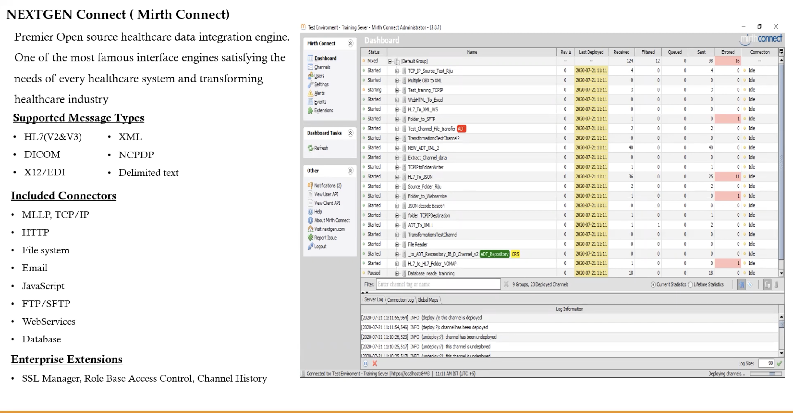
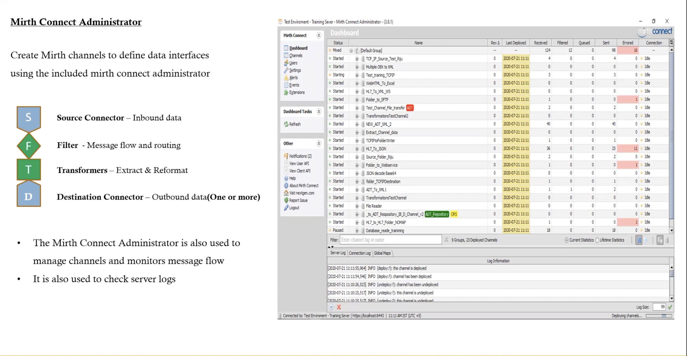
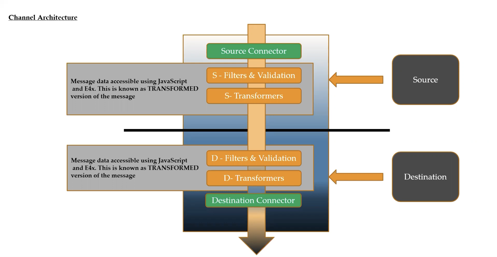
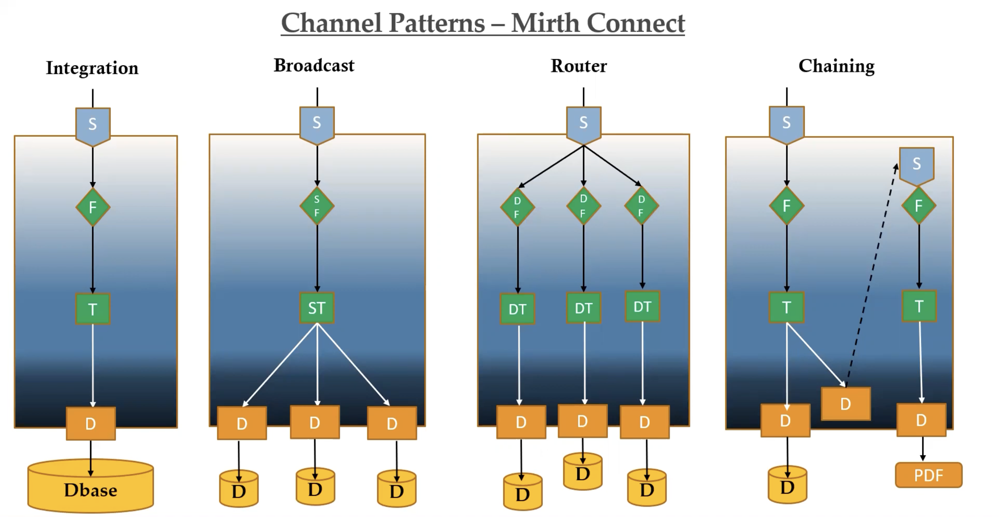

# Interfaces

An **Interface Engine** is a software application or middleware system designed to facilitate the exchange of data and information between disparate healthcare information systems, medical devices, and software applications. Interface engines play a vital role in healthcare informatics by ensuring the interoperability and seamless integration of various healthcare systems and devices.

Here are key aspects of interface engines:

1. **Data Transformation**: Interface engines can translate and transform data from one format or standard to another, ensuring that data can be accurately shared between different systems. This transformation may include converting data between HL7, XML, JSON, or other formats.

2. **Protocol Translation**: They provide the ability to translate communication protocols, allowing systems that use different protocols to communicate effectively. For example, an interface engine can convert messages from TCP/IP to HTTP or vice versa.

3. **Routing and Workflow Management**: Interface engines manage the routing of messages between systems based on specific criteria. They can prioritize, filter, and route messages to the appropriate destination, ensuring efficient workflow management.

4. **Message Enhancement**: Interface engines can enhance messages by adding or modifying data, making it more relevant or useful to the receiving system. This can include adding security credentials, timestamps, or additional context.

5. **Data Mapping**: They provide tools for mapping data fields from one system's data model to another, ensuring that data is correctly aligned when transmitted between systems.

6. **Error Handling and Logging**: Interface engines are equipped with error handling mechanisms and logging capabilities to identify and address communication issues or data discrepancies. These logs are valuable for troubleshooting and auditing.

7. **Real-Time and Batch Processing**: Interface engines support both real-time data exchange and batch processing, allowing healthcare systems to operate efficiently based on their specific requirements.

8. **Integration with Multiple Systems**: Interface engines can simultaneously integrate with a variety of healthcare systems, such as EHRs, LIS, RIS, PACS, and more, allowing them to communicate and share data seamlessly.

9. **Standard Compliance**: They adhere to industry standards, such as HL7 (Health Level 7), DICOM (Digital Imaging and Communications in Medicine), and others, to ensure that healthcare data is exchanged according to established norms.

10. **Security**: Interface engines often incorporate security measures, including encryption and access controls, to safeguard patient data during transmission.

Interface engines are fundamental in healthcare settings where multiple systems, devices, and applications need to share patient data, clinical information, and administrative details. They enhance the efficiency and accuracy of healthcare operations, support better patient care, and help healthcare organizations meet interoperability and regulatory requirements.

## Mirth

## Few Examples
1. Mirth
    1. [Introduction to the Mirth Connect Interface Engine](https://www.youtube.com/watch?v=dFiMAGFPNv8)
    
    2. https://www.capminds.com/blog/mirth-connect-the-trending-hl7-interface-engine-features-benefits/

    3. https://www.nextgen.com/solutions/interoperability/mirth-integration-engine/mirth-connect-downloads

    4. [Mirth Connect Training Tutorials For Beginners](https://www.youtube.com/watch?v=NiEB5SqQztk)

    5. [FHIR to openEHR mappings using Mirth Connect](https://www.youtube.com/watch?v=BqvCsxf_wWs)

2. [Foldda](https://foldda.com/)

## Tools
1. [SmartHL7 - HL7 Viewer, Sender and Receiver](https://smarthl7.blogspot.com/)
2. [HAPI](https://hapifhir.github.io/hapi-hl7v2/)
3. [Insomnia REST Client](https://insomnia.rest/)
4. [Wireshark](https://www.wireshark.org/)
