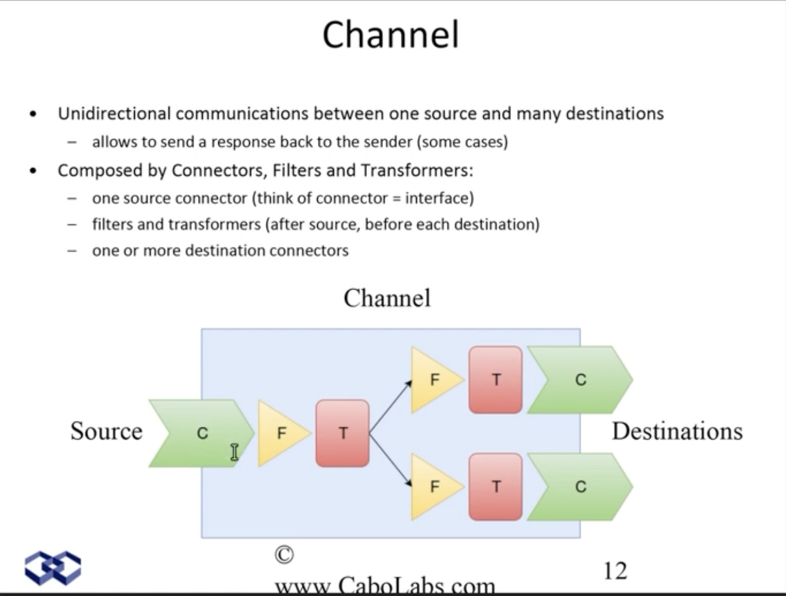

# Interfaces

An **Interface Engine** is a software application or middleware system designed to facilitate the exchange of data and information between disparate healthcare information systems, medical devices, and software applications. Interface engines play a vital role in healthcare informatics by ensuring the interoperability and seamless integration of various healthcare systems and devices.

Here are key aspects of interface engines:

1. **Data Transformation**: Interface engines can translate and transform data from one format or standard to another, ensuring that data can be accurately shared between different systems. This transformation may include converting data between HL7, XML, JSON, or other formats.

2. **Protocol Translation**: They provide the ability to translate communication protocols, allowing systems that use different protocols to communicate effectively. For example, an interface engine can convert messages from TCP/IP to HTTP or vice versa.

3. **Routing and Workflow Management**: Interface engines manage the routing of messages between systems based on specific criteria. They can prioritize, filter, and route messages to the appropriate destination, ensuring efficient workflow management.

4. **Message Enhancement**: Interface engines can enhance messages by adding or modifying data, making it more relevant or useful to the receiving system. This can include adding security credentials, timestamps, or additional context.

5. **Data Mapping**: They provide tools for mapping data fields from one system's data model to another, ensuring that data is correctly aligned when transmitted between systems.

6. **Error Handling and Logging**: Interface engines are equipped with error handling mechanisms and logging capabilities to identify and address communication issues or data discrepancies. These logs are valuable for troubleshooting and auditing.

7. **Real-Time and Batch Processing**: Interface engines support both real-time data exchange and batch processing, allowing healthcare systems to operate efficiently based on their specific requirements.

8. **Integration with Multiple Systems**: Interface engines can simultaneously integrate with a variety of healthcare systems, such as EHRs, LIS, RIS, PACS, and more, allowing them to communicate and share data seamlessly.

9. **Standard Compliance**: They adhere to industry standards, such as HL7 (Health Level 7), DICOM (Digital Imaging and Communications in Medicine), and others, to ensure that healthcare data is exchanged according to established norms.

10. **Security**: Interface engines often incorporate security measures, including encryption and access controls, to safeguard patient data during transmission.

Interface engines are fundamental in healthcare settings where multiple systems, devices, and applications need to share patient data, clinical information, and administrative details. They enhance the efficiency and accuracy of healthcare operations, support better patient care, and help healthcare organizations meet interoperability and regulatory requirements.

# Interface Engines

## Mirth
The Mirth Project is an open-source HL7 interface software that is created and supported by WebReach. Mirth is a cross-platform that enables the bi-directional exchange of HL7 messages between applications and systems over multiple modes of transport. Mirth is a flexible IT infrastructure that can play various roles using JavaScript and a point-and-click interface to map data elements. Mirth application types include integration platform/ Middleware and processing.

Mirth can be divided into three subprojects:

    Mirth Match: an open-source plug-in-based master patient index (MPI) that is yet to be available on the market.
    
    Mirth Connect: Provides the tools for testing, monitoring, developing, and deploying interfaces. Mirth Connect is specifically designed for the integration of HL7 messages.
    
    Mirth Results: Is an open-source clinical data repository that can aggregate and organize clinical information between many sources.

Mirth supported Healthcare data standards:

    DICOM: This is a standard that supports imaging and messaging between systems and imaging devices. Mirth also supports the National Council for Prescription Drug Programs Script standard.
    
    XML: This is Mirth’s original format and includes support for XSLT.
    
    HL7 v2 and v3
    
    EDI X12: is a general transaction set for insurance and healthcare.
    
    Mirth also provides support for PDF and RFT, Javascript Custom connector, Samba, FTP and SFTP, SOAP and TCP, JMS, and MLLP.

Mirth has BSD and MPL licenses and has the following databases, Oracle, Apache Derby, PostgreSQL, MySQL, and Microsoft SQL Server.

## Mirth Connect
Mirth Connect is an open-source interface engine that helps you to connect disparate systems and data. `It enables you to quickly design, builds, test, and deploy message data pipelines`. Mirth Connect also provides a wide range of features for customizing your message data pipelines. For example, you can use Mirth Connect to add new functionality to your message data pipeline or to change the way that data is processed. Mirth Connect is also very user-friendly and provides a best-in-class interface engine.  

A mirth is a powerful tool for interoperability that can be customized to fit the needs of any workflow. With Mirth, HL7 messages can be routed and transformed to fit the specifications of any system. This flexibility makes Mirth an ideal solution for healthcare organizations that need to exchange data between different systems. Mirth can also be used to create custom interfaces for specific workflow needs. For example, Mirth can be used to create an interface that converts patient data from one system into the format required by another system. By using Mirth, healthcare organizations can create interoperable solutions that are tailored to their specific needs. 

### How to install Mirth Connect?
Installing Mirth Connect is a straightforward process. First, you’ll need to create an account on the Mirth website. Once you’ve done that, you can [download](https://www.nextgen.com/solutions/interoperability/mirth-integration-engine/mirth-connect-downloads) the latest version of the software. After downloading the software, you’ll need to follow the instructions included in the installation wizard. Once the software is installed, you’ll be able to launch it and begin configuring it to meet your needs. 

Mirth Connect is an extremely versatile platform. In addition to supporting a wide range of data formats and offers built-in support for HL7v2, DICOM, and XML. It also includes a number of powerful tools for managing message workflows. As a result, it’s capable of meeting the needs of even the most complex healthcare organizations. 

## HAPI
HAPI (HL7 application programming interface) is an open-source object-orientated HL7 2.x parser for Java. HAPI was initiated by University Health Network over ten years ago and is the closest free alternative to Cloverleaf. Applications that HAPI runs in a clinical setting include clinical documents and lab messaging systems, eMPI systems, and different point-of-service systems.

Requirements to run HAPI:

    Java Virtual Machine or Java 2 Standard Development (for development)

Features

    OpenClinic GA is an open-source integrated hospital information management system and has extensive reporting and statistical capabilities. This integrated system specializes in the management of financial, clinical, administrative, pharmacy, laboratory, and other healthcare data. OpenClinic GA is multilingual and has a GNU LGPLv2.0 license. 

System requirements to run OpenClininc GA:

    Windows, Linux, or Mac OS 

Features:

    1. Customizable using java class extensions
    2. Statistics on co-morbidity, costs or care, and mortality.
    3. Complete ADT management 
    4. Unlimited free usage
    5. HL7/FHIR API for structured data transfers 
    6. LOINC coding supported (total laboratory order entry and result management)
    7. 3BT clinical thesaurus with validated coding aid for ICPC-2 and ICD-10. 
    8. Snomed CT coding 
    9. HRM module 
    10. Mobile web interface 
    11. WebRTC based module for telecommunication
    12. Integration of Weasis/DCM4CHE based DICOM- viewer and PACS solution
    13. Pathology and x-ray results management
    14. Full scheduling system integration
    15. Over 500 global implementations 
    16. Focuses on limited resource hospitals
    17. Has multimedia (audio, picture, and video) support

## PUMA Repository
PUMA (Pascal Units For Medical Applications) Repository is a compilation of Pascal units for the support of software development for medical informatics. This open-source interface engine contains reusable source code for a diverse range of application development. The source code includes a support engine for an HL7 engine (compiling, reading, and writing HL7 messages), the EDF and EDF+ (European Data Format), and the conversion of functions for units of measurement.

System requirements:

    Free Pascal and Lazarus

Features:

    1. In-built error-handling
    2. Reusable code
    3. Compatible with Free Pascal/ Lazarus and partly with RAD 4. 4. Studio, Delphi, and other competitors.
    5. Demo-applications included
    6. Curated by Zenodo, SciScrunch, and OpenAIRE
    7. BSD license for commercial projects and FOSS

## Opal
Opal is a specialist open source and open governance healthcare framework that includes an extensive library of composable modules. The healthcare framework of Opal assists in the fast development of applications. 

Opal is built on Bootstrap stack, Django, and Angular, ensuring that your application is able to be integrated with other hospital systems such as data inputs and EHRs.

System Requirements:

    Python and Pip

Features:

    1. Fast install and start-up time
    2. User-friendly configuration to save time
    3. Coded reference data
    4. Core Clinical reference data implemented as Abstract Subrecords
    5. Open RESTful APIs
    6. A Full audit trail
    7. Applications are configured to provide user management

## FreeMED
FreeMED is an open-source medical software specializing in hospital management systems. FreeMED provided an HL7 interface that governs the data transfer between healthcare providers. This hospital management system provides extensive import and export formats, is multilingual, provides support in many languages, and is readily expandable, with developers easily able to customize the system. FreeMED is written in PHP, provides reliable data security, and offers a logical user interface.

System requirements to run FreeMED:

    Docker

Features:

    1. Document management
    2. HL7 interface
    3. Self-hosting facilities
    4. XML-RPC Backend
    5. Modular Architecture
    6. Extensible
    7. Billing Module
    8. Patient Schedule
    9. The source code is available in Github.

## Few Examples
1. Mirth
    1. [Introduction to the Mirth Connect Interface Engine](https://www.youtube.com/watch?v=dFiMAGFPNv8)
    
    2. https://www.capminds.com/blog/mirth-connect-the-trending-hl7-interface-engine-features-benefits/

    3. https://www.nextgen.com/solutions/interoperability/mirth-integration-engine/mirth-connect-downloads

    4. [Mirth Connect Training Tutorials For Beginners](https://www.youtube.com/watch?v=NiEB5SqQztk)

    5. [FHIR to openEHR mappings using Mirth Connect](https://www.youtube.com/watch?v=BqvCsxf_wWs)

2. [Foldda](https://foldda.com/)

## Tools
1. [SmartHL7 - HL7 Viewer, Sender and Receiver](https://smarthl7.blogspot.com/)
2. [HAPI](https://hapifhir.github.io/hapi-hl7v2/)
3. [Insomnia REST Client](https://insomnia.rest/)
4. [Wireshark](https://www.wireshark.org/)
